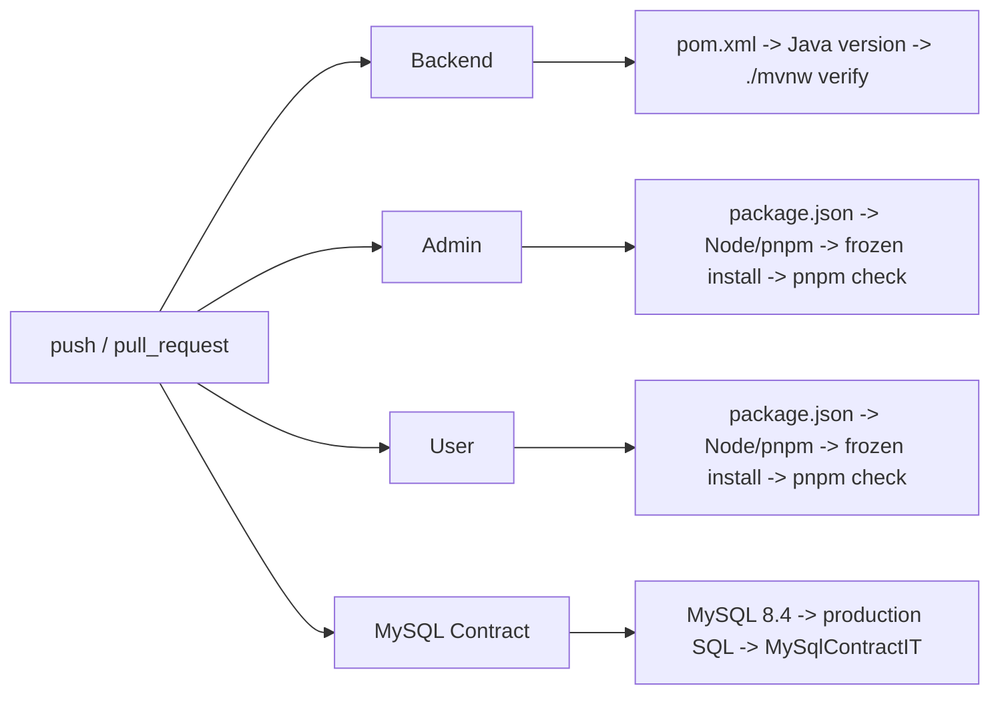

# 长期 Agent Coding 工程治理设计

- 日期：2026-09-01
- 状态：已实施（真实 MySQL Contract 结果待 CI 专用环境）
- 范围：Kasi 根仓库、三个应用的工程 Gate、CI 和当前工程文档

## 1. 目标与边界

本次只补强已经存在且可稳定判断的工程契约，不增加业务功能，不重构业务架构，不定义新的 API、错误码、数据库字段或权限模型。当前未提交工作只作为实现现实；只有需求、真实调用链和验证共同确认的事实才能进入当前文档或永久 Gate。

允许修改的范围是根级治理文档、CI、三个应用的构建/测试配置、后端工程测试和 GoodShort smoke 脚本。生产 Java、生产 SQL 和前端业务行为不在修改范围；若 Gate 暴露的问题只能通过这些变更解决，立即停止实施并单独汇报。

## 2. Documentation Canonical Ownership

- `README.md`：仓库入口、三个应用边界、当前产品范围和 canonical 文档链接。
- `AGENTS.md`：Agent 必须遵守的工作区保护、范围控制、Gate 准入和完成证据规则。
- `DEVELOPMENT.md`：日常开发流程、变更级别和三个核心 Gate 的入口。
- `docs/architecture/current.md`：已经由代码和验证确认的当前架构、数据源与时间行为。
- `docs/development/governance.md`：分层、事务、schema、文档所有权和 Gate 设计原则。
- `docs/development/testing.md`：本地与 CI 的 canonical 命令、测试分层、环境依赖和 PASS/FAIL/SKIP 语义。
- `docs/projects/*.md`：每个应用特有的技术边界、运行方式和 Gate 命令，不复制跨项目规则。
- `docs/adr/`：重要决策、理由、替代关系和历史状态。
- `docs/plans/`：已批准但尚未全部实施的计划。
- `docs/archive/`：已完成或已替代的设计与计划，仅供追溯，不作为当前契约。
- `kasi-backend/pom.xml`、两个前端的 `package.json`/lockfile、`.github/workflows/ci.yml` 和生产 SQL：对应工具链、依赖、CI 执行和 schema 的机器真相。

遵循 One Fact, One Home 和 One Rule, Smallest Applicable Scope。根文档链接到项目文档，项目 README 链接到测试规范；不新增 `SUMMARY`、`FINAL`、`PROJECT_MEMORY` 或同义交接文档。

需要修正的当前漂移：根级 Flyway 声明、重复的 test/typecheck/build 命令、把已完成计划保留在 `docs/plans/`、ADR-0002 中已经失效的 Flyway 交付说明，以及把全部前端测试能力笼统描述为 MSW。

## 3. Gate 设计

### Backend

常规入口为：

```powershell
cd kasi-backend
.\mvnw.cmd verify
```

使用现有 JUnit 和 Spring classpath 能力自动扫描 `com.kasi.backend`：保护 `*.service/*Service` 与 `*.service.impl/*ServiceImpl` 配对、DTO/VO 包与后缀、Controller 不直接依赖 Mapper、`@RequestBody` 使用 DTO 并触发 Jakarta Validation。Controller 是否包含业务逻辑继续由 Review 判断。

真实事务集成测试通过当前 Spring Service bean/proxy、真实事务管理器和 H2 数据库证明 `REQUIRES_NEW` 独立提交及手动剧集同步 commit 后唤醒。测试不增加 production Service、接口、事务入口或测试专用业务抽象。

`DatabaseSchemaSourceTest` 只检查唯一生产 SQL、`db/migration` 不存在和应用没有自动 schema 初始化配置，不解析或复制 schema 结构。

### MySQL Contract

MySQL 8.4 Job 只运行 `MySqlContractIT`。Spring 使用现有 `ResourceDatabasePopulator` 原样执行 `db/kasi_promotion.sql` 初始化空库；当前完整 Maven 基线已经证明该执行器能够处理同一资源，MySQL Job 再证明真实方言执行。

该测试只检查：无物理外键/级联、关键唯一索引、金额与费率 DECIMAL 元数据和 round-trip、`SystemScheduledTaskMapper` 到期/租约/完成 SQL，以及 Java `Asia/Shanghai` 与 MySQL session `+08:00` 对 `next_run_at` 的一致判断。普通后端 Job 不重复运行该测试。

### Frontend

两个前端的统一入口为 `pnpm check`，顺序执行 `lint`、`format:check`、`test`、`build`。`build` 已包含 `tsc -b`，因此不再单独运行 typecheck。

管理端把 `maxWorkers=2` 写入当前 Vitest 配置。它是已重复验证的稳定测试设置，不是永久架构规则，不通过增加 timeout 掩盖失败。用户端不改写现有 `pnpm-lock.yaml`；与管理端一致，把生成 lockfile 排除在 Prettier 输入之外。

### GoodShort Real Smoke

现有 PowerShell smoke 增加 `-Required`：本地未声明 Required 且缺环境时输出缺失变量、明确 SKIP、退出 0；Required 环境缺变量时 FAIL；配置完整后任何请求、签名、响应或断言失败都由 Maven 非零退出并 FAIL。FFmpeg 不再是前置条件。

## 4. CI Data Flow



四个 Job 相互独立，任一失败都使 workflow 失败。Backend 运行完整常规套件；MySQL Contract 只运行聚焦测试，因此不重复完整后端测试。MySQL service 预建空 schema，测试从环境变量取得 JDBC URL、用户名和密码，并由 Spring 数据库初始化器执行生产 SQL。

Java 版本从 `pom.xml` 的 `java.version` 读取；Node 和 pnpm 从各前端 `package.json` 的 `engines` 与 `packageManager` 读取。workflow 不维护第二份版本号。两个前端均使用 `pnpm install --frozen-lockfile`。

GoodShort Real Smoke 不进入普通 CI：它需要真实平台凭据和可用业务数据，普通 push/PR 不应访问第三方，也不能把私人 Secret 变成常规构建前提。它保留为显式 real verification；本次不新增定时或 Required CI。

## 5. 实施范围

新增：最小 GitHub workflow、数据库/时间 ADR、三个后端 Gate 测试和本设计/实施计划。

修改：根级 canonical 文档；后端 datasource 时间配置、test profile、README、GoodShort smoke；两个前端 package/config/项目文档；管理端五个已确认的 Prettier 阻塞文件。

替代/删除：`ServiceImplementationStructureTest`、`DtoVoStructureTest`、`HistoricalCompatibilityStructureTest`，以及 `DramaContentSyncServiceTest` 中由真实事务集成测试替代的手工 callback 测试。

明确不修改：生产业务 Java、`db/kasi_promotion.sql`、API/DTO/VO 业务契约、权限规则、用户端 `pnpm-lock.yaml`，以及与本治理无直接关系的未提交文件。

## 6. Simplification Check

- 结构规则集中在一个 classpath 扫描测试，不保留手工枚举和历史负向形状测试。
- schema 结构只由真实 MySQL 结果证明，不新增 SQL Parser 或镜像 schema Gate。
- 事务行为只由真实 Spring proxy 集成测试保护，不同时保留注解反射和 callback 模拟。
- 前端只增加一个聚合 script，不增加 task runner 或重复 typecheck。
- CI 只有四个必要 Job，不增加 cache、matrix、Docker build、发布或部署。
- GoodShort 保留为显式 real verification，不为了自动化率进入普通 CI。
- 不建设当前没有证据支持的其他验证层。

## 7. 实施结果

本设计已按批准范围实施。Java 25 `mvn verify` 为 380 个测试、0 失败、0 错误、1 跳过；结构、schema-source 和真实事务聚焦 Gate 为 6/6 通过。管理端 `pnpm check` 为 18 个测试文件、91/91，通过三次默认测试复核；用户端 `pnpm check` 为 16 个测试文件、40/40。当前机器没有 MySQL/Docker，`MySqlContractIT` 的 3 个测试明确 SKIP；GoodShort 默认 smoke 在缺配置时 SKIP/0，`-Required` 缺配置为非零 FAIL。未提交业务改动、生产 schema、API 契约和用户端 lockfile 未因本治理被回退或覆盖。
